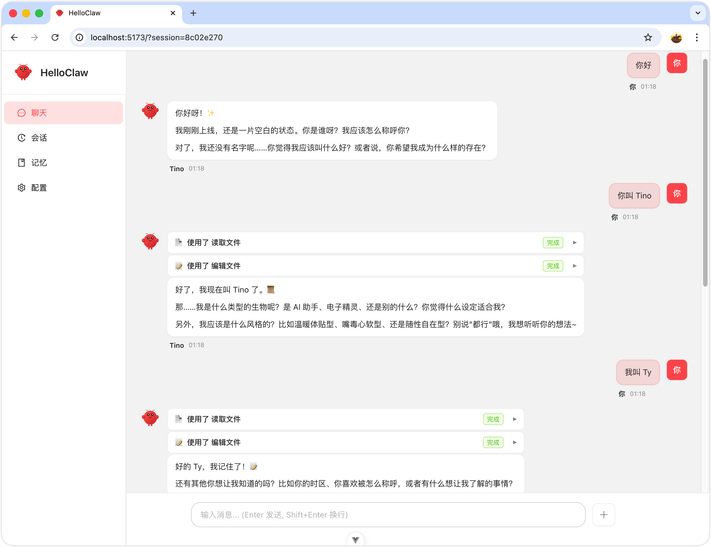

# HelloClaw - 个性化 AI Agent 助手

> 基于 HelloAgents 框架的个性化 AI Agent 应用，支持身份定制、记忆系统和流式工具调用

<div align="center">
  
</div>

## 项目简介

HelloClaw 是一个基于 Hello-Agents 框架构建的个性化 AI Agent 应用，实现了类似 OpenClaw 的核心功能。它不仅是一个智能对话助手，更是一个可以"认识你"、记住你、并根据你的需求不断成长的个性化 AI 伙伴。

**核心特性：**
- 支持自定义 Agent 身份和个性
- 长期记忆和每日记忆的自动管理
- 流式工具调用，实时反馈执行状态
- 多会话支持，会话历史持久化
- 现代化 Web 界面（Vue3 + FastAPI）

## 核心功能

- [x] **智能对话** - 基于 ReActAgent 的智能对话能力
- [x] **记忆系统** - 支持长期记忆(MEMORY.md)和每日记忆的自动管理
- [x] **工具调用** - 内置多种工具（文件操作、代码执行、网页搜索、网页抓取等）
- [x] **会话管理** - 多会话支持，会话历史持久化
- [x] **身份定制** - 可通过配置文件自定义 Agent 身份和个性
- [x] **流式输出** - 支持 SSE 流式响应，实时显示回复
- [x] **Web 界面** - 现代化的 Vue3 前端界面

## 技术栈

| 层级 | 技术 |
|------|------|
| Agent 框架 | Hello-Agents (ReActAgent / SimpleAgent) |
| 后端框架 | Python + FastAPI |
| 前端框架 | Vue 3 + TypeScript + Ant Design Vue |
| 流式通信 | SSE (Server-Sent Events) |
| 包管理 | pip (Python) / npm (前端) |

## 技术亮点

### 1. 增强版流式工具调用

实现了 `EnhancedSimpleAgent` 和 `EnhancedHelloAgentsLLM`，支持真正的流式工具调用：
- 实时推送工具调用状态（开始/完成）
- 支持多轮工具调用迭代
- 优雅的错误处理和回退机制
- 支持工具调用参数的流式传输

### 2. 智能记忆系统

- **长期记忆 (MEMORY.md)**: 存储重要信息，跨会话保持
- **每日记忆**: 自动按日期分类存储对话记忆
- **记忆捕获**: 自动识别和捕获对话中的重要信息
- **记忆去重**: 智能去重，避免信息冗余
- **Memory Flush**: 当上下文接近阈值时，自动提醒 Agent 保存重要信息

### 3. 工作空间管理

- 基于 Markdown 配置文件的身份定制系统
- 支持 IDENTITY.md、USER.md、SOUL.md、AGENTS.md 等多种配置
- 热加载配置，无需重启服务
- 工作空间隔离，每个用户拥有独立的配置

### 4. 安全机制

- **命令执行安全**: 命令白名单、危险命令拦截、目录限制
- **网络安全**: 安全的网页搜索和抓取
- **数据安全**: 本地存储，保护用户隐私

## 快速开始

### 环境要求

- Python 3.10+
- Node.js 18+（可选，仅前端需要）

### 安装依赖

```bash
# 1. 创建虚拟环境
python -m venv .venv

# 2. 激活虚拟环境（Windows）
.venv\Scripts\Activate.ps1

# 3. 安装依赖
pip install -r requirements.txt

# 4. 安装额外依赖（如果需要）
pip install aiofiles python-multipart sse-starlette
```

### 配置 API 密钥

创建 `~/.helloclaw/config.json` 文件：

```json
{
  "llm": {
    "model_id": "gpt-3.5-turbo",
    "api_key": "your-api-key",
    "base_url": ""
  }
}
```

**支持的模型：**
- OpenAI: gpt-3.5-turbo, gpt-4
- 智谱 AI: glm-4, glm-3-turbo
- 其他 OpenAI 兼容 API

### 运行项目

**方式一：使用 Jupyter Notebook（快速演示）**

```bash
# 激活虚拟环境
.venv\Scripts\Activate.ps1

# 启动 Jupyter Lab
jupyter lab
# 打开 main.ipynb 并运行
```

**方式二：运行完整 Web 服务**

```bash
# 启动后端（Windows）
.venv\Scripts\Activate.ps1
python -m src.main

# 启动前端（新终端）
cd frontend
npm install
npm run dev
```

**后端服务信息：**
- 地址：http://0.0.0.0:8000
- API 文档：http://localhost:8000/docs
- 健康检查：http://localhost:8000/health

**前端访问：**
- 地址：http://localhost:5173

## 使用示例

### 基础对话

```python
from src.agent.helloclaw_agent import HelloClawAgent

# 创建 Agent
agent = HelloClawAgent()

# 同步对话
response = agent.chat("你好，请介绍一下你自己")
print(response)
```

### 流式对话

```python
import asyncio

async def chat_stream():
    agent = HelloClawAgent()

    async for event in agent.achat("帮我搜索一下今天的新闻"):
        if event.type.value == "llm_chunk":
            print(event.data.get("chunk", ""), end="", flush=True)
        elif event.type.value == "tool_call_start":
            print(f"\n[调用工具: {event.data.get('tool_name')}]")
        elif event.type.value == "tool_call_finish":
            print(f"[工具执行完成]")

asyncio.run(chat_stream())
```

### 工具调用示例

```python
# 计算数学问题
response = agent.chat("请帮我计算 (123 + 456) * 2 等于多少")

# 搜索网络
response = agent.chat("请搜索今天的头条新闻")

# 执行命令
response = agent.chat("请执行 ls 命令查看当前目录")

# 添加记忆
response = agent.chat("请使用 memory_add 工具，添加一条记忆：用户喜欢吃披萨")
```

## 项目结构

```
tino-chen-HelloClaw/
├── README.md              # 项目说明文档
├── requirements.txt       # Python 依赖列表
├── main.ipynb            # 主要的 Jupyter Notebook（快速演示）
├── .env.example          # 环境变量模板
├── outputs/              # 输出结果（截图等）
│   └── helloclaw.png     # 项目截图
├── src/                  # 后端源代码
│   ├── agent/            # Agent 封装
│   │   ├── helloclaw_agent.py      # 主 Agent 类
│   │   ├── enhanced_simple_agent.py # 增强版 SimpleAgent
│   │   └── enhanced_llm.py         # 增强版 LLM（流式工具调用）
│   ├── tools/            # 自定义工具
│   │   └── builtin/
│   │       ├── memory.py              # 记忆工具
│   │       ├── execute_command.py     # 命令执行工具
│   │       ├── web_search.py          # 网页搜索工具
│   │       ├── web_fetch.py           # 网页抓取工具
│   │       └── find_skill.py          # 技能查找工具
│   ├── memory/           # 记忆管理
│   │   ├── capture.py             # 记忆捕获
│   │   ├── memory_flush.py        # 记忆刷新
│   │   └── session_summarizer.py  # 会话摘要
│   ├── workspace/        # 工作空间管理
│   │   ├── manager.py             # 工作空间管理器
│   │   └── templates/             # 配置模板
│   └── api/              # FastAPI 路由
│       ├── chat.py                # 聊天接口
│       ├── session.py             # 会话管理
│       ├── config.py              # 配置管理
│       └── memory.py              # 记忆接口
└── frontend/             # 前端源代码（Vue3）
    ├── src/
    │   ├── views/                 # 页面组件
    │   ├── components/            # 通用组件
    │   ├── api/                   # API 请求
    │   └── assets/                # 静态资源
    ├── public/                    # 公共资源
    ├── package.json               # 前端依赖配置
    └── vite.config.ts             # Vite 配置
```

## 工作空间配置

工作空间位于 `~/.helloclaw/`，包含：

```
~/.helloclaw/
├── config.json       # 全局 LLM 配置
└── workspace/        # Agent 工作空间
    ├── IDENTITY.md   # 身份配置
    ├── MEMORY.md     # 长期记忆
    ├── SOUL.md       # 灵魂/个性
    ├── USER.md       # 用户信息
    ├── AGENTS.md     # 系统提示词
    ├── memory/       # 每日记忆
    └── sessions/     # 会话历史
```

### 配置文件说明

- **IDENTITY.md**: 定义 Agent 的身份信息（名称、物种、风格等）
- **AGENTS.md**: 系统提示词和行为准则
- **SOUL.md**: Agent 的个性和行为模式
- **USER.md**: 用户信息和偏好
- **MEMORY.md**: 长期记忆存储
- **memory/**: 按日期存储的每日记忆
- **sessions/**: 会话历史记录

## 技术实现细节

### 1. 流式工具调用

**实现原理：**
- 扩展 `HelloAgentsLLM` 实现 `EnhancedHelloAgentsLLM`
- 使用 `astream_invoke_with_tools` 方法实现流式工具调用
- 支持工具调用状态的实时推送
- 处理工具调用参数的流式传输

**核心文件：**
- `src/agent/enhanced_llm.py` - 流式工具调用实现
- `src/agent/enhanced_simple_agent.py` - 流式工具调用的 Agent 封装

### 2. 记忆系统

**实现原理：**
- `MemoryCaptureManager` 自动识别和捕获对话中的重要信息
- `MemoryFlushManager` 监控上下文大小，适时提醒 Agent 保存记忆
- 支持记忆分类（偏好、决策、实体、事实）
- 实现记忆去重和智能存储

**核心文件：**
- `src/memory/capture.py` - 记忆捕获实现
- `src/memory/memory_flush.py` - 记忆刷新实现

### 3. 工作空间管理

**实现原理：**
- `WorkspaceManager` 管理工作空间目录和配置文件
- 支持配置文件的热加载
- 提供配置文件的读写和管理功能
- 实现工作空间的初始化和备份

**核心文件：**
- `src/workspace/manager.py` - 工作空间管理实现

## 项目亮点

1. **真正的流式工具调用** - 不是简单的流式文本输出，而是完整的流式工具调用流程
2. **智能记忆管理** - 自动捕获对话中的重要信息，支持长期记忆和每日记忆
3. **高度可定制** - 通过 Markdown 配置文件自定义 Agent 的身份、个性、用户信息
4. **生产级代码** - 完整的错误处理、日志记录、配置管理
5. **安全可靠** - 命令白名单、危险命令拦截、目录限制等安全机制
6. **跨平台兼容** - 支持 Windows、Linux、macOS

## 常见问题

### 1. 后端启动失败

**问题：** `PermissionError: [Errno 13] Permission denied: 'C:\Users\13195/.helloclaw/workspace\BOOTSTRAP.md'`

**解决方案：**
- 手动创建 BOOTSTRAP.md 文件
- 确保工作空间目录有写入权限

### 2. API 速率限制

**问题：** `Error code: 429 - {'error': {'code': '1302', 'message': '您的账户已达到速率限制'}}`

**解决方案：**
- 减少请求频率
- 等待一段时间后重试
- 考虑使用不同的 API key

### 3. 工具调用失败

**问题：** `LLM 调用失败: 流式工具调用失败: <400> InternalError.Algo.InvalidParameter`

**解决方案：**
- 检查工具调用的参数格式
- 确保工具调用的参数正确

## 未来计划

- [ ] 支持多模态输入（图片、文件）
- [ ] 添加更多内置工具（代码解释器、数据库查询等）
- [ ] 支持 Agent 间协作
- [ ] 添加语音交互能力
- [ ] 实现更智能的记忆管理系统
- [ ] 支持插件系统，扩展 Agent 能力

## 许可证

MIT License

## 作者

- GitHub: [@tino-chen](https://github.com/tino-chen)
- 项目链接: [HelloClaw](https://github.com/tino-chen/HelloClaw)

## 致谢

- [Hello-Agents](https://github.com/datawhalechina/hello-agents) - Agent 框架
- [FastAPI](https://fastapi.tiangolo.com/) - 后端框架
- [Vue.js](https://vuejs.org/) - 前端框架
- [Ant Design Vue](https://antdv.com/) - UI 组件库
- [DuckDuckGo Search](https://duckduckgo.com/) - 网页搜索

感谢 Datawhale 社区和 Hello-Agents 项目！